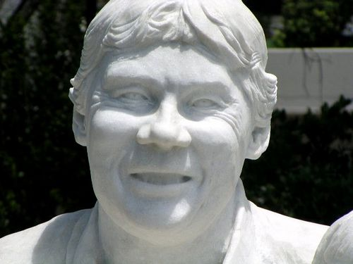
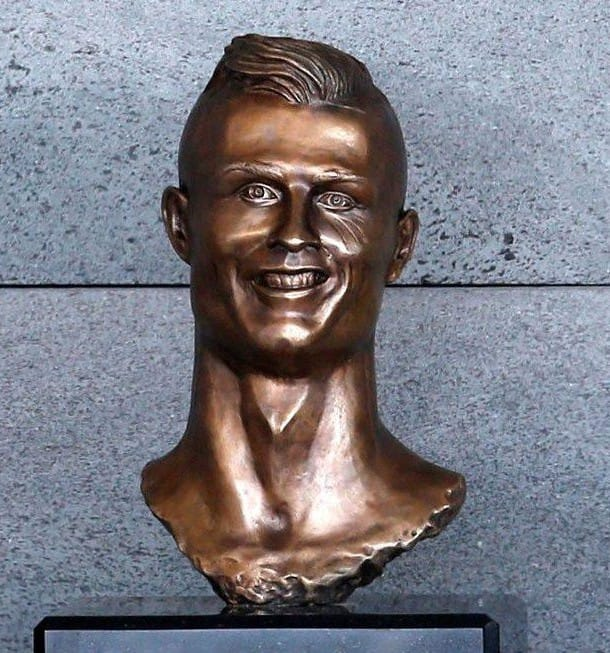
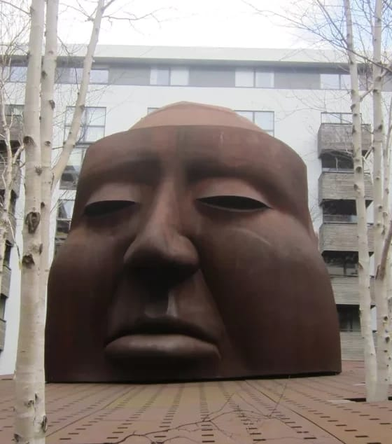
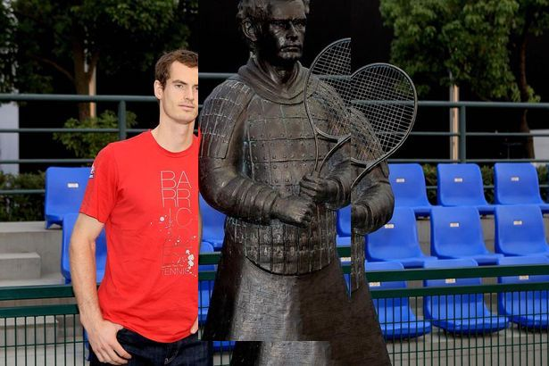

## Rules

- One point for correct identification

  

## Question 1
</img>

## Question 2
</img>

## Question 3
</img>

## Question 4
</img>

## Question 5
</img>

## Question 6
</img>

## Question 7
</img>

## Question 8
</img>

## Question 9
</img>

## Question 10
</img>

